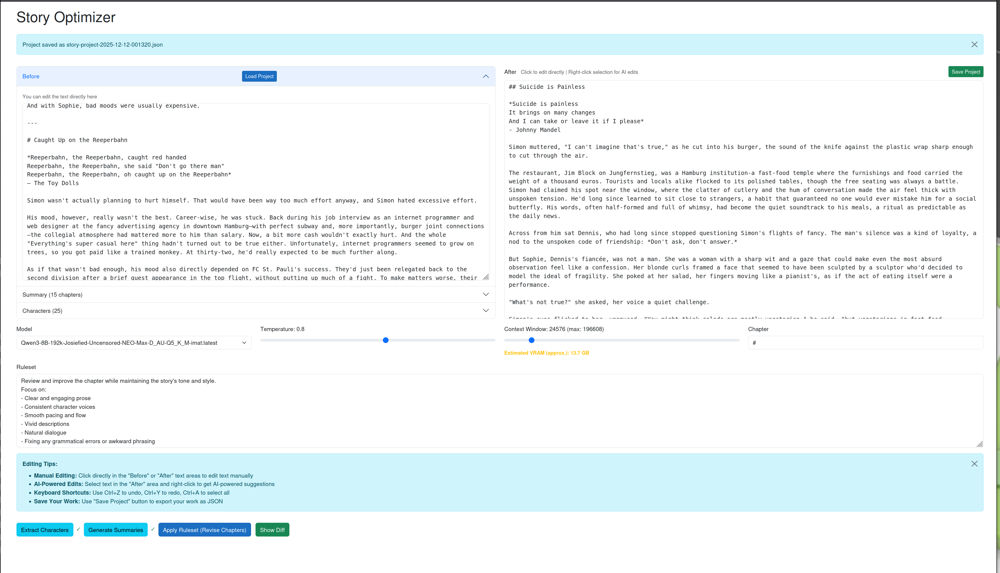
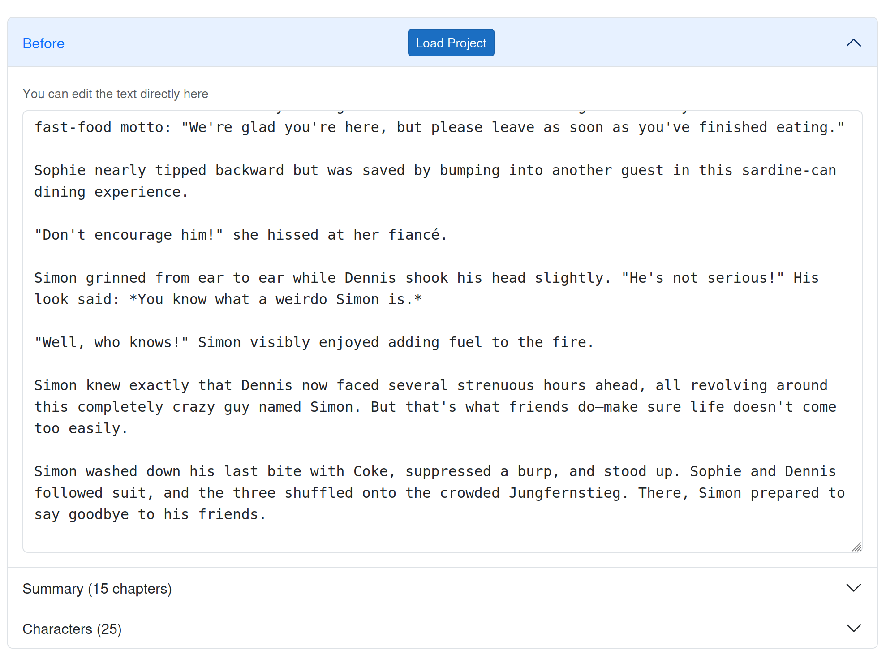
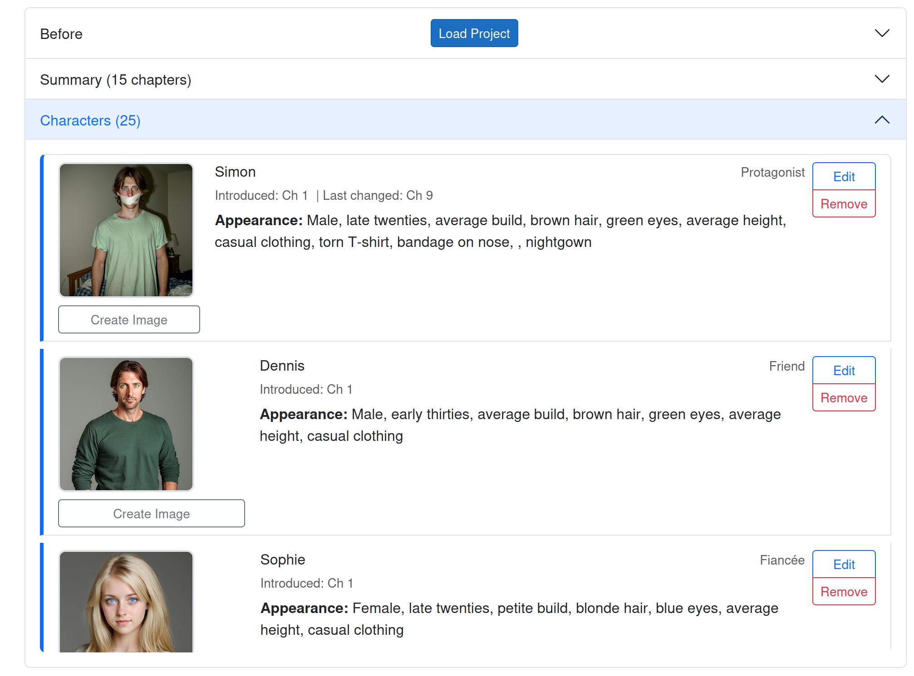
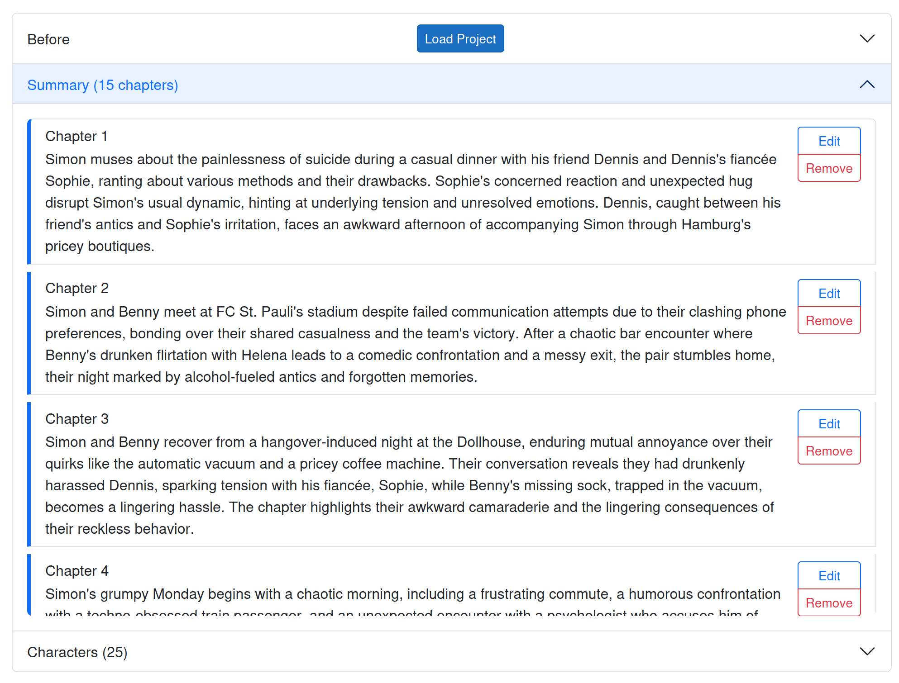
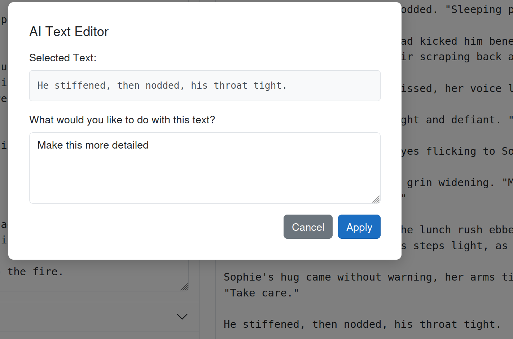

# Story Optimizer

An AI-powered story revision tool that helps you optimize and improve your written content using local LLMs via Ollama and optional image generation via ComfyUI.



## Table of Contents

- [Features](#features)
- [Running with Docker](#running-with-docker)
- [Configuration](#configuration)
- [Getting Started](#getting-started)
- [Workflow Guide](#workflow-guide)
- [Troubleshooting](#troubleshooting)

## Features

- AI-powered story revision using local LLMs (Ollama)
- Character extraction and tracking across chapters
- Automatic chapter summarization
- Context-aware text processing with customizable rulesets
- Right-click AI editing for specific passages
- Optional character portrait generation (ComfyUI)
- Project save/load functionality

## Running with Docker

### Prerequisites

1. **Ollama** - Required for AI text processing
   - Install Ollama on your host machine: [https://ollama.ai](https://ollama.ai)
   - Pull your desired model(s), for example:
     ```bash
     ollama pull llama3.2:latest
     ollama pull qwen2.5:14b
     ```
   - Ensure Ollama is running and accessible on port 11434

2. **ComfyUI** - Optional, only required for character image generation
   - Install and run ComfyUI: [https://github.com/comfyanonymous/ComfyUI](https://github.com/comfyanonymous/ComfyUI)
   - Ensure it's accessible on port 8188
   - If you don't want to use image generation, you can skip this

### Starting the Application

1. **Clone the repository:**
   ```bash
   git clone <repository-url>
   cd aihelpers
   ```

2. **Configure service URLs:**

   Edit `docker-compose.yml` and update the service URLs to match your setup:
   ```yaml
   environment:
     - Services__OllamaBaseUrl=http://your-host:11434
     - Services__ComfyUIBaseUrl=http://your-host:8188
   ```

   Replace `your-host` with:
   - `host.docker.internal` (on Mac/Windows Docker Desktop)
   - Your machine's IP address (on Linux)
   - `localhost` if services are on the same machine

3. **Build and run:**
   ```bash
   docker-compose up -d
   ```

4. **Access the application:**

   Open your browser and navigate to: `http://localhost:5000`

5. **Stop the application:**
   ```bash
   docker-compose down
   ```

## Configuration

### Model Selection



1. **Model**: Select from available Ollama models
   - **Recommended**: 7B-14B parameter models work well (e.g., `llama3.2:latest`, `qwen2.5:14b`)
   - Larger models provide better quality but require more VRAM and time

2. **Temperature** (0.0 - 1.5)
   - **Lower (0.3-0.5)**: More consistent, focused output - good for grammar fixes
   - **Higher (0.8-1.2)**: More creative, varied output - good for creative rewrites
   - **Recommended**: 0.7-0.9 for story optimization

3. **Context Window Size**
   - Determines how much text the model can process at once
   - **Trade-off**: Larger = better context understanding, but higher VRAM usage
   - **Recommended**: Start with 8192, increase if you have VRAM available
   - The UI shows estimated VRAM usage in real-time

4. **Chapter Token**
   - The marker that separates chapters in your text (default: `##`)
   - Example: If your text uses `## Chapter 1`, keep the default `##`
   - The tool will split your text at these markers

## Getting Started

### Preparing Your Text

Your story should be formatted with chapter markers. For example:

```
## Chapter 1
This is the content of chapter one...

## Chapter 2
This is the content of chapter two...
```

Paste or type your text into the "Before" text area.

## Workflow Guide

Follow these steps in order for the best results:

### Step 1: Extract Characters



1. Click the **"Extract Characters"** button
2. The AI will analyze your text and identify:
   - Character names
   - Character roles (protagonist, antagonist, supporting, etc.)
   - Physical appearance descriptions
   - Which chapter they were introduced in

**Why this matters**: Character information helps the AI maintain consistency when revising your story, especially for longer texts. The AI uses this context to ensure character descriptions and behaviors remain consistent across chapters.

**Note**: You can edit, add, or remove characters after extraction using the Edit/Remove buttons.

### Step 2: Generate Chapter Summaries



1. Click the **"Generate Summaries"** button
2. The AI will create a concise summary for each chapter

**Why this matters**: Summaries provide the AI with context about the overall story arc when processing individual chapters. This helps maintain plot consistency and narrative flow across the entire story.

**Note**: You can edit or remove summaries after generation.

### Step 3: (Optional) Generate Character Images

Character image generation is **just for fun** and not required for the story optimization process.

If you have ComfyUI configured:
1. Open the Characters accordion
2. Click the **"Create Image"** button on any character
3. The AI will generate a portrait based on the character's appearance description

### Step 4: Set Up Your Ruleset

The ruleset defines what improvements the AI should make to your text. Customize it based on your needs:

**Default ruleset:**
```
Review and improve the chapter while maintaining the story's tone and style.
Focus on:
- Clear and engaging prose
- Consistent character voices
- Smooth pacing and flow
- Vivid descriptions
- Natural dialogue
- Fixing any grammatical errors or awkward phrasing
```

**Example custom rulesets:**

For grammar/clarity focus:
```
Fix grammatical errors and improve clarity while maintaining the author's voice.
Do not change the plot or add new content.
```

For creative enhancement:
```
Enhance the prose with more vivid descriptions and stronger emotional impact.
Improve dialogue to be more natural and character-specific.
Maintain the plot but enrich the storytelling.
```

### Step 5: Revise Your Story

1. Click **"Apply Ruleset (Revise Chapters)"**
2. The AI will process each chapter using:
   - Your ruleset instructions
   - Character information for consistency
   - Chapter summaries for context
3. The revised text appears on the right side in real-time
4. You can manually edit the output directly in the text area

### Step 6: Fine-Tune Specific Passages



For targeted improvements to specific passages:

1. **Select text** in the "After" text area (right side)
2. **Right-click** the selected text
3. Enter your specific instruction, for example:
   - "Make this more dramatic"
   - "Fix the grammar"
   - "Rewrite in a more formal tone"
   - "Add more sensory details"
4. Click **"Apply"**
5. The AI will revise just that selected passage

This is perfect for polishing specific sections without re-running the entire process.

### Step 7: Save Your Work

Click the **"Save Project"** button to export everything as a JSON file:
- Original text
- Revised text
- Characters
- Summaries
- Settings (model, temperature, ruleset, etc.)

You can reload this project later using the **"Load Project"** button.

### Step 8: View Changes (Optional)

Click **"Show Diff"** to open a side-by-side comparison of your original and revised text in a new window.

## Tips for Best Results

1. **Start with character extraction and summaries**: These provide crucial context for better revisions

2. **Use appropriate context window sizes**:
   - Longer chapters need larger context windows
   - Watch the VRAM estimate to avoid out-of-memory errors

3. **Experiment with temperature**:
   - Start at 0.7-0.8 for balanced results
   - Increase for more creative rewrites
   - Decrease for more conservative edits

4. **Iterate**:
   - Save your project frequently
   - Try different rulesets on the same text
   - Use right-click editing to polish specific sections

5. **Review carefully**:
   - The AI is a tool to assist, not replace your judgment
   - Always review the output for accuracy and consistency
   - Use the diff view to spot unintended changes

## Troubleshooting

### "No models available"

- Ensure Ollama is running on your host machine
- Verify the `OllamaBaseUrl` in `docker-compose.yml` points to the correct host
- Check that you've pulled at least one model: `ollama list`

### "Error connecting to Ollama"

- On Linux: Use your machine's IP address instead of `localhost`
- On Mac/Windows: Try `host.docker.internal` instead of `localhost`
- Verify Ollama is accessible: `curl http://your-host:11434/api/tags`

### "Out of memory" or VRAM errors

- Reduce the context window size
- Use a smaller model (e.g., 7B instead of 14B)
- Use a more heavily quantized model (e.g., Q4 instead of Q6)

### Image generation not working

- ComfyUI is optional - skip this feature if you don't need it
- Verify ComfyUI is running and accessible on port 8188
- Check that the workflow file `Services/image.json` exists
- Review ComfyUI logs for errors

### Slow processing

- This is normal for larger models and longer texts
- Consider using a smaller model for faster processing
- Reduce context window size
- Process fewer chapters at a time

## Technical Details

- **Framework**: ASP.NET Core 9.0 Blazor Server
- **AI Backend**: Ollama (local LLM inference)
- **Image Generation**: ComfyUI (optional)
- **Container**: Docker with multi-stage build
- **Port**: 5000 (host) -> 8080 (container)


